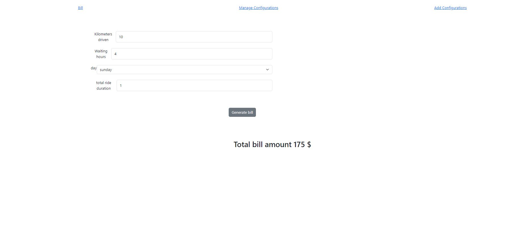
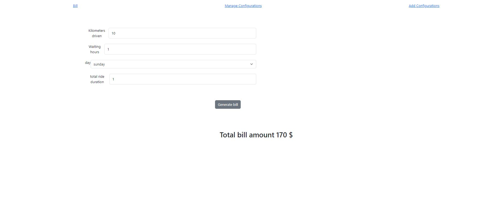
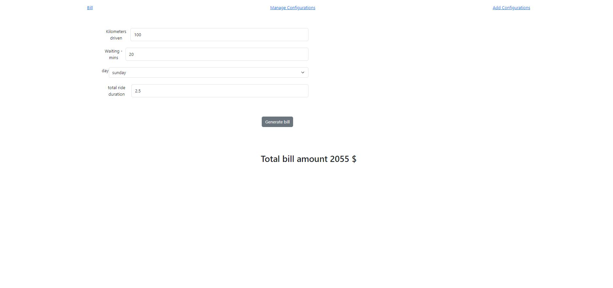
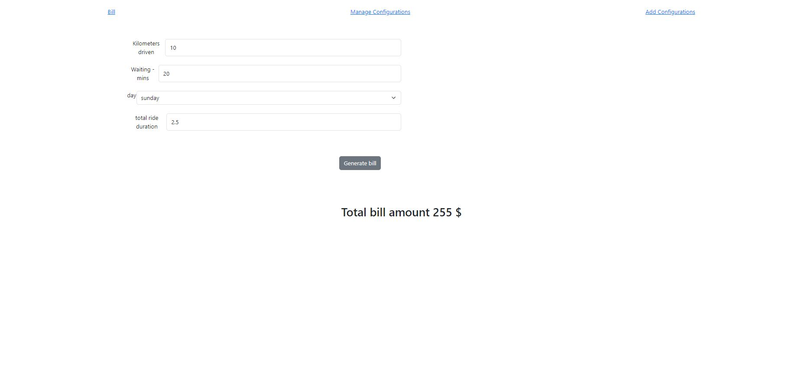
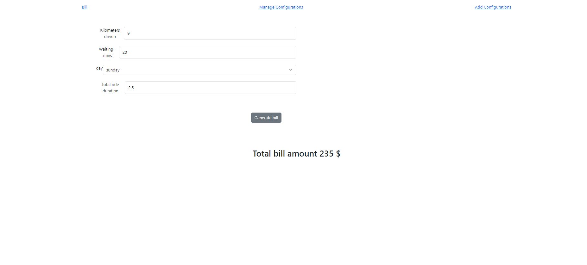

<h1>Repository fn_backend</h1>
<h4>Tech stack : Java, Spring boot, Postgres SQL</h4>
<h5>Setup details and environmental requirements</h5>

* 1.environmental requirements : PostgresSQL, and Java 

* 2.Configure the backend application with Java, postgres SQL(default database name postgres, with default username and password , that is postgres, start the java application for table creation)

* 3.Backend jar file is attached in this repo, with configuration from point 2

* run the .jar file with following command
command -> nohup java -jar filename.jar

* For further setup details, check fn_frontend repos->readme->software configuration

* By deafult the backend runs at 8080 port, and even frontend is configured for the same port in the localhost

 
 
<h2>Some new Testing outputs</h2>
 

1

 

2

 

3

 

4

 

5

 

1

 

1

