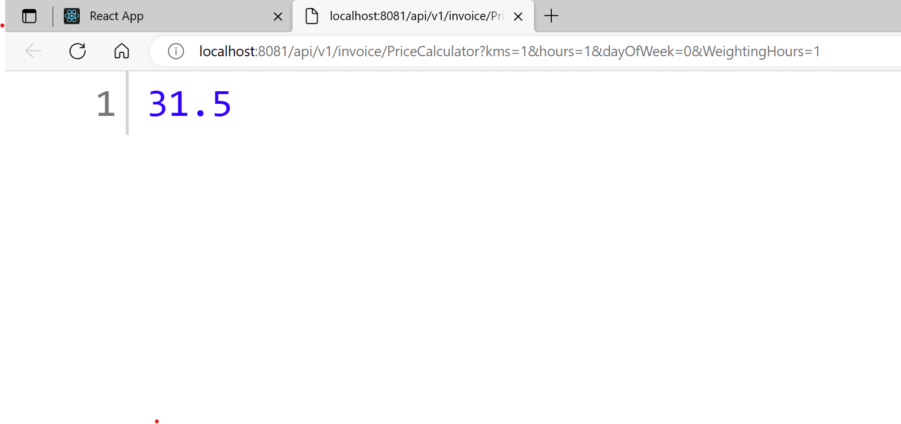
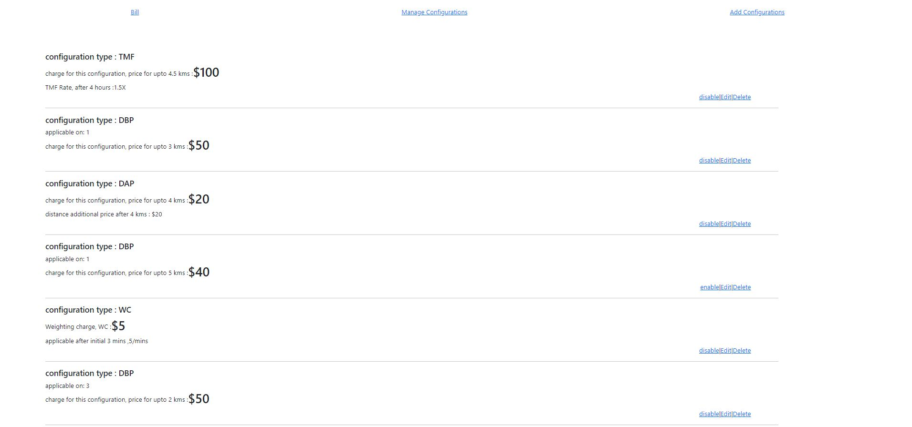
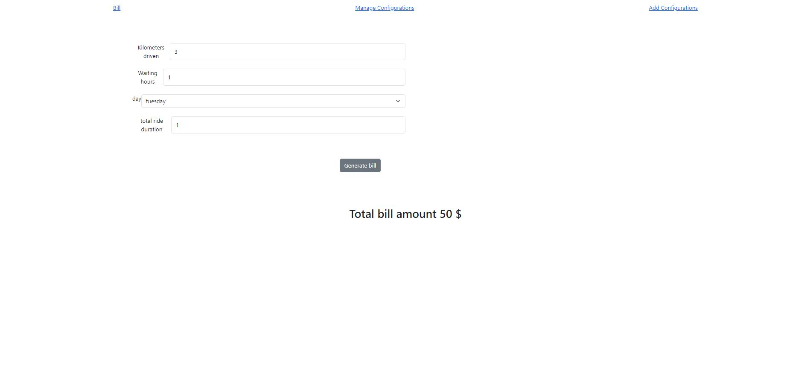

<h1>Repository fn_backend</h1>
<h4>Tech stack : Java, Spring boot, Postgres SQL</h4>
<h5>Setup details and environmental requirements</h5>

* 1.environmental requirements : PostgresSQL, and Java 

* 2.Configure the backend application with Java, postgres SQL(default database name postgres, with default username and password , that is postgres, start the java application for table creation)

* 3.Backend jar file is attached in this repo(here 🚴‍♀️ https://drive.google.com/file/d/1B_0TZXtjYU09FUh1IBQjMe3IAvYIWur9/view?usp=drive_link), with configuration from point 2

* run the .jar file with following command
command -> nohup java -jar filename.jar

* For further setup details, check fn_frontend repos->readme->software configuration

* By deafult the backend runs at 8080 port, and even frontend is configured for the same port in the localhost

<h2>API: Billing api</h2>

Configure the backend application with Java, postgres SQL(default database postgres, with username and password being postgres)

Once the backend is up and running, your will be able to reach the Rest API, https://your-ip:port/api/v1/invoice/PriceCalculator?kms=1&hours=1&dayOfWeek=0&WeightingHours=1

GET Request

parameter : Takes in parameter kms,hours,dayOfWeek, and WeightingHours(similiar to from UI, refer page 1.Bill

Response : response with a string value of amount calculated using formula(from notion page)

<h4>Api Image</h4>

 
 
<h2>Some new Testing outputs</h2>
 

configurations before the   tests

 

1

 

2

 

3

 

4

 

5

 

6

